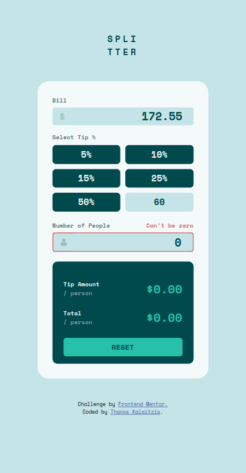
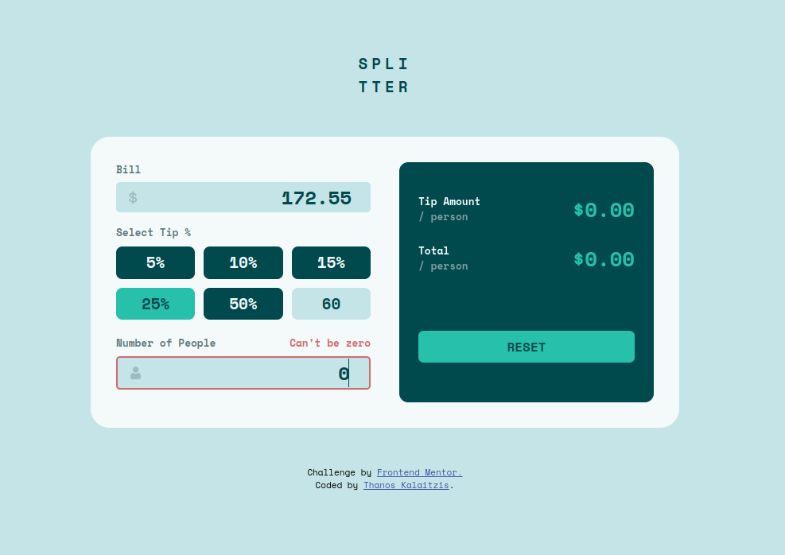

# Frontend Mentor - Tip calculator app solution

This is a solution to the [Tip calculator app challenge on Frontend Mentor](https://www.frontendmentor.io/challenges/tip-calculator-app-ugJNGbJUX). Frontend Mentor challenges help you improve your coding skills by building realistic projects.

## Table of contents

- [Frontend Mentor - Tip calculator app solution](#frontend-mentor---tip-calculator-app-solution)
  - [Table of contents](#table-of-contents)
  - [Overview](#overview)
    - [The challenge](#the-challenge)
    - [Screenshots](#screenshots)
    - [Links](#links)
  - [My process](#my-process)
    - [React](#react)
    - [Built with](#built-with)
    - [What I learned](#what-i-learned)
    - [Useful resources](#useful-resources)
  - [Author](#author)

**Note: Delete this note and update the table of contents based on what sections you keep.**

## Overview

### The challenge

Users must be able to:

- View the optimal layout for the app depending on their device's screen size
- See hover states for all interactive elements on the page
- Calculate the correct tip and total cost of the bill per person

### Screenshots




### Links

- [Solution URL](https://github.com/Thanos-M11/react-tip-calculator)
- [Live Site URL](https://react-tip-calculator-thanosdev.netlify.app/)

## My process

#### React

- Created a `Context API` combined with a `useReducer()` hook -> `BillContext.jsx`.
  - we provide access to the initial state and the dispatch handlers for all the components under the `BillProvider` component.
  - created a custom hook `useBill()` to consume the context in any component that has the right to have access.
  - We have a very good control of state management with this combination.
- The `App.jsx` shows a very clean tree of the whole structure as per below:

```js
export default function App() {
  return (
    <FlexPage>
      <Title />
      <Container>
        <BillProvider>
          <DataList>
            <Bill />
            <Tips />
            <People />
          </DataList>
          <SummaryList>
            <TipOutput />
            <TotalOutput />
            <Reset />
          </SummaryList>
        </BillProvider>
      </Container>
      <Attribution />
    </FlexPage>
  );
}
```

- #### Component structure:

  - `FlexPage`: a flex page contains the whole body
  - `Title`: the main title of the view
  - `BillProvider`: the context provider that provides access to its children for the initial state and the dispatch handlers.
    - `DataList`: a section with the data that the user enters
      - `Bill`: the section where the user enters the bill amount
      - `Tips`: the section where the user chooses a predefined button with the tip % or he enters a custom tip %.
      - `People`: the section where the uer enters the amount of people for the bill to be divided to.
    - `SummaryList`: the output of the data (calculations)
      - `TipOutput`: the tip per person amount
      - `TotalOutput`: the total per person amount
      - `Reset`: a reset button

### Built with

- Semantic HTML5 markup
- CSS custom properties
- Flexbox
- CSS Grid
- Mobile-first workflow
- [React](https://reactjs.org/) - JS library
  - contextAPI,
  - useReducer()
  - useRef(),
  - useEffect(),

### What I learned

- How to hide the side arrows of an input element of type `number` in CSS:

```css
/* hide the side bars for chrome, edge, safari and opera */
.input::-webkit-inner-spin-button {
  appearance: none;
  margin: 0;
}

/* hide the side bars for the firefox browser */
.input {
  -moz-appearance: textfield;
  margin: 0;
}
```

- Created a custom react hook to handle events that control click out of an element or pressing the enter key.

```js
import { useRef, useEffect } from "react";

export function useClickOut() {
  const parentRef = useRef();
  const inputRef = useRef();

  useEffect(function () {
    function callback(e) {
      if (e.target !== inputRef.current) {
        parentRef.current.style.border = "1px solid transparent";
      }
    }
    document.addEventListener("click", callback);
    return () => document.removeEventListener("click", callback);
  }, []);

  useEffect(function () {
    function callback(e) {
      if (e.key === "Enter") {
        parentRef.current.style.border = "1px solid transparent";
        inputRef.current.blur();
      }
    }
    document.addEventListener("keydown", callback);
    return () => document.removeEventListener("keydown", callback);
  }, []);

  return [parentRef, inputRef];
}
```

On this custom hook we use two `useRef()` hooks, one as a parent element and the second as a child element. This is because we have designed an input component that has a `section` as a parent element and an `img`, `input` elements as children.

We want to control a click away of the `input` element and the Enter key. As soon as either of these two happen we want the parent element's border to be set to `transparent`.

We are using two `useEffect()` hooks one for the click away and one for the `Enter` key.

### Useful resources

Book: [CSS in Depth by Keith J. Grant](https://www.manning.com/books/css-in-depth-second-edition)

[Josh's Custom CSS Reset](https://www.joshwcomeau.com/css/custom-css-reset/)

## Author

- Website - [Thanos Kalaitzis](https://thanosdev.netlify.app)
- Github - [@Thanos-M11](https://github.com/Thanos-M11)
- LinkedIn - [Thanos Kalaitzis](https://www.linkedin.com/in/thanoskalaitzis/)
- Frontend Mentor - [@Thanos-M11](https://www.frontendmentor.io/profile/Thanos-M11)
